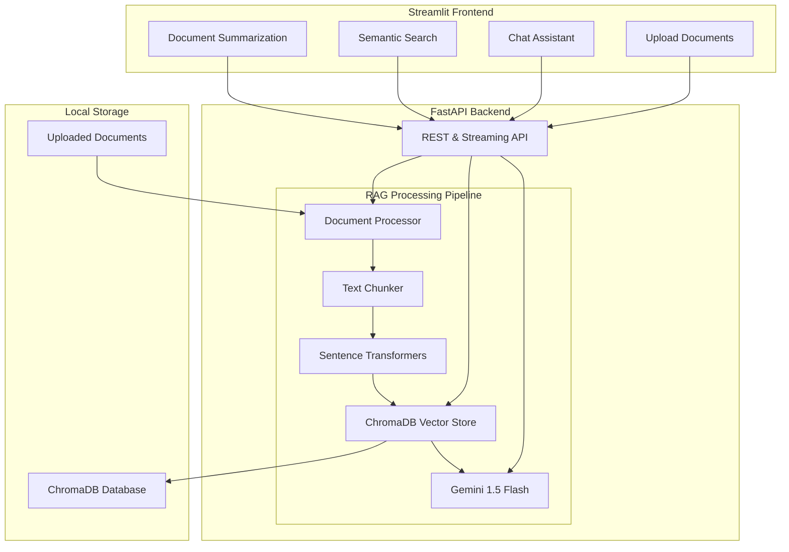

# � Simple RAG Assistant

A beginner-friendly **Retrieval-Augmented Generation (RAG)** application designed for learning and portfolio projects. This project demonstrates the core RAG workflow: document ingestion, text chunking, vector embeddings, semantic search, and AI-powered question answering.

## 🎯 Learning Objectives

This project is perfect for beginners to understand:
- **RAG Fundamentals**: How retrieval-augmented generation works
- **Vector Embeddings**: Converting text to numerical representations
- **Semantic Search**: Finding similar content using vector similarity
- **Document Processing**: Extracting and chunking text from various file formats
- **Stream Processing**: Real-time AI response streaming

---

## 🏗️ System Architecture



---

## 🚀 Features

### Core RAG Workflow
- **Document Upload**: Support for PDF, DOCX, PPTX, and TXT files
- **Text Extraction**: Page-by-page text extraction from documents
- **Text Chunking**: Intelligent text splitting with overlap for context preservation
- **Vector Embeddings**: Converting text chunks to vector embeddings using sentence-transformers
- **Semantic Search**: Finding similar content using cosine similarity in ChromaDB
- **AI Q&A**: Answering questions using retrieved context with Gemini API
- **Document Summarization**: Generating structured summaries of uploaded documents

### Technical Stack
- **Frontend**: Streamlit (Python web framework)
- **Backend**: FastAPI (Python web framework)
- **Vector Database**: ChromaDB (local vector store)
- **Embeddings**: sentence-transformers (all-MiniLM-L6-v2)
- **LLM**: Google Gemini 1.5 Flash API
- **Document Processing**: pypdf, python-docx, python-pptx

---

## 📋 Prerequisites

- Python 3.8 or higher
- Google Gemini API Key (free tier available)
- pip (Python package manager)

---

## 🔧 Installation

### 1. Clone the Repository

```bash
git clone <repository-url>
cd DocQuery
```

### 2. Set Up Backend

```bash
cd backend
python -m venv venv
venv\Scripts\activate  # On Windows
source venv/bin/activate  # On Mac/Linux

pip install -r requirements.txt
```

### 3. Configure Environment Variables

Create a `.env` file in the `backend` directory:

```env
GEMINI_API_KEY=your_gemini_api_key_here
```

Get your free API key from: https://makersuite.google.com/app/apikey

### 4. Set Up Frontend

```bash
cd frontend
python -m venv env
env\Scripts\activate  # On Windows
source env/bin/activate  # On Mac/Linux

pip install -r requirements.txt
```

### 5. Configure Frontend Environment

Create a `.env` file in the `frontend` directory:

```env
BACKEND_URL=http://127.0.0.1:8000
```

---

## 🎮 Usage

### Start the Backend Server

```bash
cd backend
venv\Scripts\activate  # On Windows
python -m backend.app.main
```

The backend will start at: `http://127.0.0.1:8000`

### Start the Frontend

```bash
cd frontend
env\Scripts\activate  # On Windows
streamlit run app.py
```

The frontend will open in your browser at: `http://localhost:8501`

---

## 📖 How to Use

### 1. Upload Documents
- Navigate to **Upload Documents** in the sidebar
- Select PDF, DOCX, PPTX, or TXT files
- Click **Process & Upload** to ingest documents
- The system will extract text, chunk it, and create vector embeddings

### 2. Chat with Documents
- Navigate to **Chat Assistant**
- Ask questions about your uploaded documents
- The AI will retrieve relevant context and provide answers with source citations

### 3. Semantic Search
- Navigate to **Semantic Search**
- Enter a search term or concept
- View semantically similar passages with relevance scores

### 4. Document Summarization
- Navigate to **Summaries**
- Select a document from your library
- Generate an AI-powered summary with key insights

---

## 🧠 How RAG Works

This project implements the standard RAG pipeline:

1. **Document Ingestion**: Upload documents (PDF, DOCX, PPTX, TXT)
2. **Text Extraction**: Extract text page-by-page from documents
3. **Text Chunking**: Split text into smaller chunks (1000 chars with 200 overlap)
4. **Embedding Generation**: Convert each chunk to a vector using sentence-transformers
5. **Vector Storage**: Store embeddings in ChromaDB with metadata
6. **Query Processing**: Convert user query to vector embedding
7. **Semantic Search**: Find similar chunks using cosine similarity
8. **Context Retrieval**: Retrieve top-K most relevant chunks
9. **Prompt Construction**: Build prompt with retrieved context
10. **AI Generation**: Generate answer using Gemini API with retrieved context

---

## 📁 Project Structure

```
DocQuery/
├── backend/
│   ├── app/
│   │   ├── main.py              # FastAPI application entry point
│   │   ├── api/
│   │   │   └── endpoints.py    # API endpoints
│   │   └── services/
│   │       ├── doc_processor.py    # Document text extraction
│   │       ├── vector_store.py     # ChromaDB vector operations
│   │       └── rag_service.py      # RAG logic & LLM integration
│   ├── requirements.txt        # Backend dependencies
│   └── .env                   # Backend environment variables
├── frontend/
│   ├── app.py                 # Streamlit application entry point
│   ├── pages/
│   │   ├── upload_page.py     # Document upload interface
│   │   ├── chat_page.py       # Chat assistant interface
│   │   ├── search_page.py     # Semantic search interface
│   │   └── summary_page.py    # Document summarization interface
│   ├── services/
│   │   └── api_client.py      # Backend API client
│   ├── components/
│   │   └── styles.py          # UI styling
│   └── requirements.txt        # Frontend dependencies
└── sample_docs/
    └── sample_policy.txt      # Sample document for testing
```

---

## 🔑 Key Concepts for Interviews

### Vector Embeddings
- Converting text to numerical vectors that capture semantic meaning
- Similar concepts have similar vectors in high-dimensional space
- Used for semantic search instead of keyword matching

### ChromaDB
- Open-source vector database for storing and querying embeddings
- Supports cosine similarity search
- Stores vectors with metadata for filtering

### RAG (Retrieval-Augmented Generation)
- Combines retrieval systems with LLMs
- Retrieves relevant context before generating answers
- Reduces hallucinations by grounding responses in retrieved data

### Sentence Transformers
- Pre-trained models for generating text embeddings
- all-MiniLM-L6-v2 is fast and efficient for general use
- Maps text to 384-dimensional vectors

### Text Chunking
- Splitting long documents into smaller, manageable pieces
- Preserves context with overlapping chunks
- Improves retrieval accuracy for specific information

---

## 🛠️ Technologies Used

- **Streamlit**: Frontend web framework
- **FastAPI**: Backend web framework
- **ChromaDB**: Vector database
- **sentence-transformers**: Text embedding model
- **Google Gemini**: Large Language Model API
- **pypdf**: PDF text extraction
- **python-docx**: DOCX text extraction
- **python-pptx**: PPTX text extraction

---

## 📝 Notes for Beginners

- This project uses **in-memory document storage** for simplicity
- No authentication or user management (simplified for learning)
- No conversation history persistence (session-based only)
- Uses **semantic search only** (no keyword search)
- Designed for **local development** and learning purposes

---

## 🚀 Future Enhancements (Learning Path)

After mastering this project, consider adding:
- User authentication with JWT
- Conversation history with database storage
- Hybrid search (semantic + keyword)
- Document comparison features
- Report generation
- Docker containerization
- Deployment to cloud platforms

---

## 📄 License

This project is open source and available for educational purposes.

---

## 🤝 Contributing

This is a learning project. Feel free to fork, modify, and use it for your portfolio!
